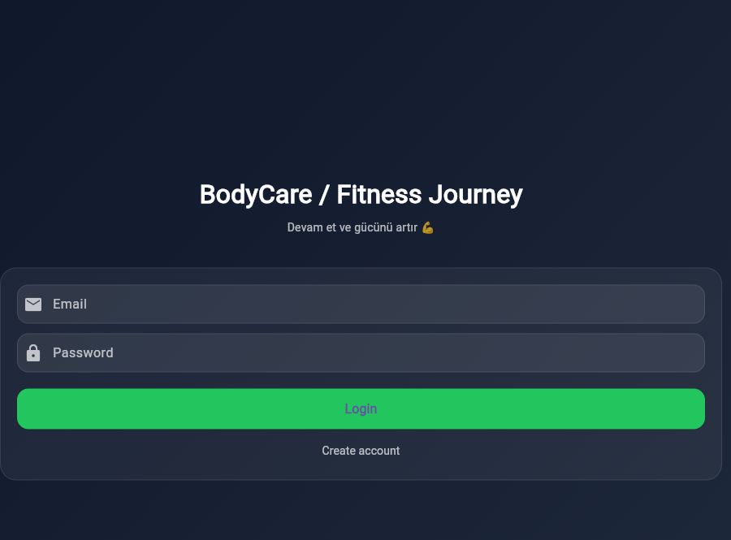
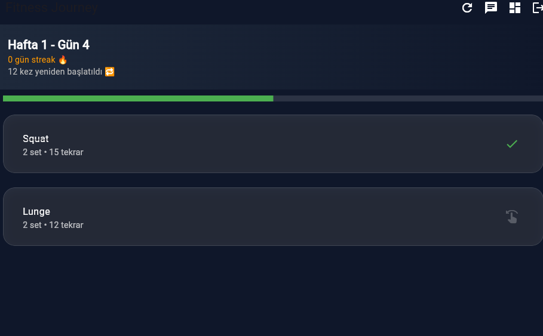
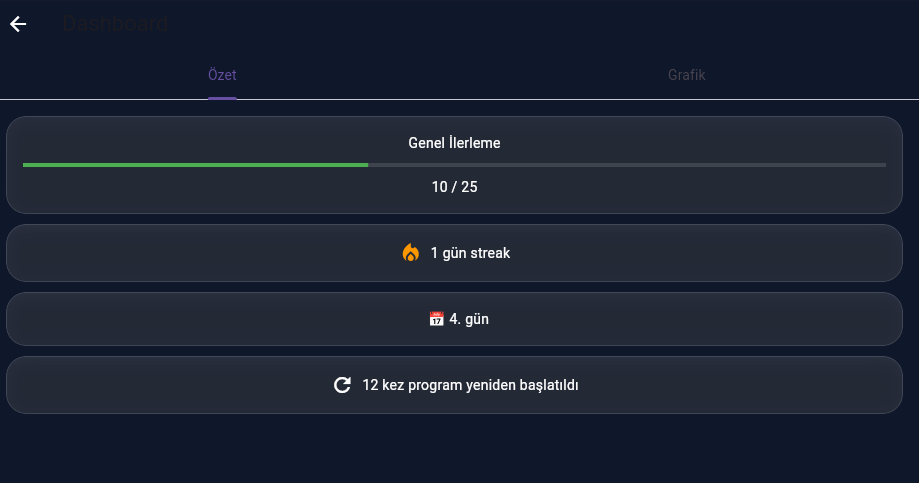

# Body Care App

A Flutter-based fitness tracking mobile application designed to help users follow weekly workout programs and build consistent exercise habits.

---

## Overview

Body Care App provides users with personalized weekly exercise routines, including sets, repetitions, and daily workout plans.

The app tracks completed and missed workouts, sends reminders for incomplete exercises, and generates daily/weekly progress reports through a dashboard.

It is built using Flutter and Firebase for real-time data management and cloud integration.

---

## Features

### Workout System
- Weekly structured workout programs
- Daily exercise plans with sets and reps
- Exercise completion tracking

### Reminder System
- Notification for incomplete workouts
- Evening reminder for missed exercises
- Habit reinforcement system

### Progress Tracking
- Daily performance tracking
- Weekly progress reports
- Completed vs skipped exercise analytics
- Visual dashboard insights

---

## Technologies Used

- Flutter (Mobile App Development)
- Firebase Authentication
- Firebase Firestore (Database)
- Firebase Cloud Messaging (Notifications)

---

## App Flow

```text
User logs in
        ↓
Weekly workout plan loaded
        ↓
Daily exercises displayed
        ↓
User marks completed / skipped
        ↓
Firebase stores progress
        ↓
Evening reminder triggered (if incomplete)
        ↓
Weekly report generated
```

---

## System Modules

- **Workout Module** → Exercise plans & sets
- **Tracking Module** → Completion monitoring
- **Notification Module** → Reminder system
- **Analytics Module** → Daily & weekly reports
- **Firebase Layer** → Data storage & sync

---

## Purpose

This application was developed to:

- Help users maintain consistent workout habits
- Provide structured fitness plans
- Improve discipline through reminders
- Track fitness progress over time
- Offer simple and effective fitness analytics

---

## Screenshots

### Home / Login


### Daily Workout Plan


### Progress Report


---

## Firebase Integration

- User authentication
- Real-time workout tracking
- Cloud-based progress storage
- Notification scheduling system

---

## Future Improvements

- AI-based workout recommendations
- Nutrition tracking module
- Social sharing system
- Wearable device integration
- Advanced analytics charts

---

## Notes

This project is a mobile fitness tracking application built for personal habit formation and structured workout planning.

---

## Author

Developed by **[Your Name]**